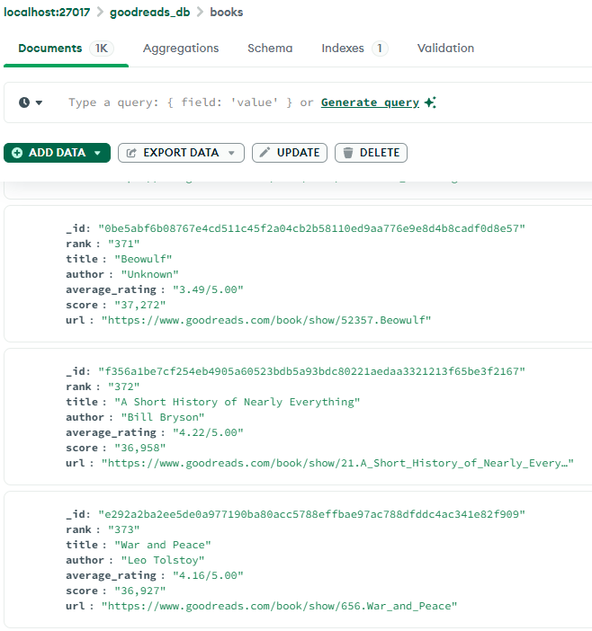

## Python Web Scraping Projects

- <a href="https://github.com/AndyEstevez/Python-WebScrape-Projects/blob/main/Letterboxd_Top250_Scraper.py">Get Top 100 and Top Genre-specific films from Letterboxd's Top 250</a>
    - Used BeautifulSoup and Selenium Webdriver to scrape HTML content
    - Used Inquirer for prompting for user input 

- <a href="https://github.com/AndyEstevez/Python-WebScrape-Projects/tree/main/goodreads_fiction">Get Top 1000 Fiction books from Goodreads community</a>
    - Used Scrapy for getting HTML info and save to json
    - Store into MongoDB with Scrapy pipeline
    - No duplicate items getting stored into MongoDB when running the spider  
